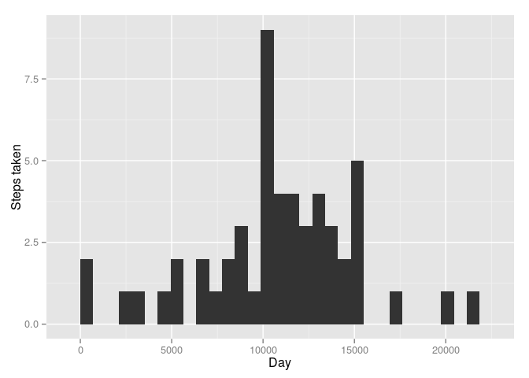
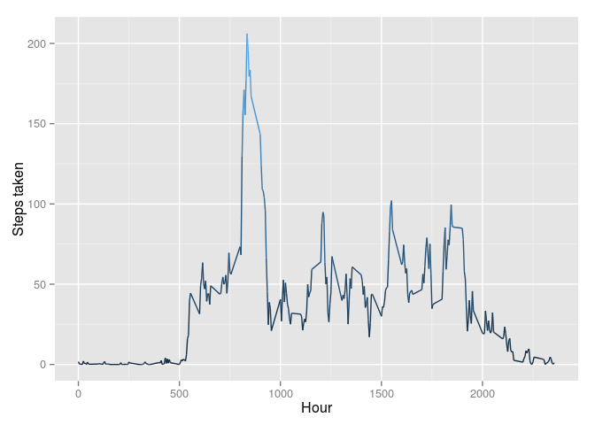
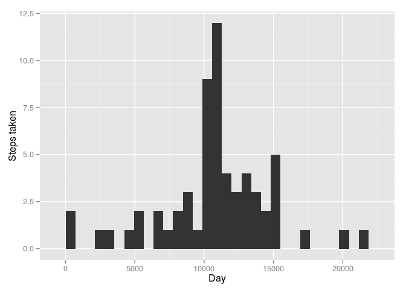
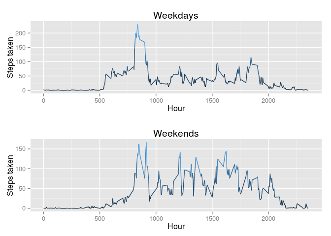

# Reproducible Research: Peer Assessment 1


## Loading and preprocessing the data

```r
#loading and preparing data
library(ggplot2)
library(gridExtra)
data <- read.csv("activity.csv")
data$date <- as.Date.factor(data$date)
data$date <- as.POSIXct(data$date)
```


## What is mean total number of steps taken per day?

```r
#calculating steps per day
days <- aggregate(data$steps, list(data$date), sum)

#removing missing values
days <- na.omit(days)

#histogram for steps per day
hist <- ggplot(days,aes(x=Group.1 ,y=x, color=x))+geom_bar(stat='identity')+ylab("Steps taken")+xlab("Day")+theme(legend.position="none")

#mean and median of steps per day
mean <- mean(days$x)
median <- median(days$x)

#presenting results
hist
```

 

```r
mean
```

```
## [1] 10766.19
```

```r
median
```

```
## [1] 10765
```


## What is the average daily activity pattern?

```r
#calculating steps per interval
intervals <- aggregate(data$steps, list(data$interval), mean, na.rm = T)

#plotting average daily activity
plot <- ggplot(intervals, aes(x=Group.1 ,y=x, color=x))+geom_line()+ylab("Steps taken")+xlab("Hour")+theme(legend.position="none")

#calculating interval with maximum number of steps taken on average
maximum <-intervals[intervals$x==max(intervals$x),]

#presenting results
plot
```

 

```r
maximum
```

```
##     Group.1        x
## 104     835 206.1698
```


## Imputing missing values

```r
#calculating number of missing values
a <- is.na(data$steps)
numNA <- sum(a)

#calculating means for intervals
int <- aggregate(data$steps, list(data$interval), mean, na.rm = T)

#filling in missing data with average numbers of steps per interval across all days
data2 <- data
data2$steps[a & data2$interval == int$Group.1] <- int[, 2]

#histogram for steps per day for new dataset
days2 <-aggregate(data2$steps, list(data2$date), sum)
hist2 <- ggplot(days2,aes(x=Group.1 ,y=x, color=x))+geom_bar(stat='identity')+ylab("Steps taken")+xlab("Day")+theme(legend.position="none")

#mean and median of steps per day for new dataset
mean2 <- mean(days2$x)
median2 <- median(days2$x)

#presenting results
numNA
```

```
## [1] 2304
```

```r
hist2
```

 

```r
mean2
```

```
## [1] 10766.19
```

```r
median2
```

```
## [1] 10766.19
```
In this case histograms of daily activity look quite different after NA's were filled but it has no substantial impact on mean and median measurements.


## Are there differences in activity patterns between weekdays and weekends?

```r
#Adding factor variable for weekday/weekend
data2$day <- weekdays(data2$date)
data2$day[data2$day == "sobota" | data2$day == "niedziela"] <- "weekend"
data2$day[data2$day != "weekend"] <- "weekday"
data2$day <- as.factor(data2$day)

#Plotting data for weekends and weekdays
weekday <- aggregate(data2$steps[data2$day == "weekday"], list(data$interval[data2$day == "weekday"]), mean)
weekend <- aggregate(data2$steps[data2$day == "weekend"], list(data$interval[data2$day == "weekend"]), mean)
weekdayPlot <- ggplot(weekday, aes(x=Group.1 ,y=x, color=x))+geom_line()+ylab("Steps taken")+xlab("Hour")+theme(legend.position="none")+ggtitle("Weekdays")
weekendPlot <- ggplot(weekend, aes(x=Group.1 ,y=x, color=x))+geom_line()+ylab("Steps taken")+xlab("Hour")+theme(legend.position="none")+ggtitle("Weekends")
grid.arrange(weekdayPlot, weekendPlot, nrow=2)
```

 
